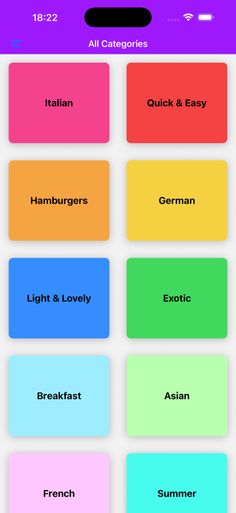
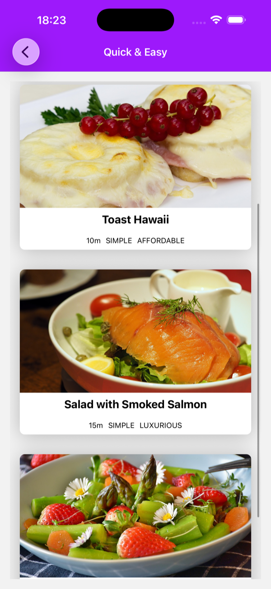
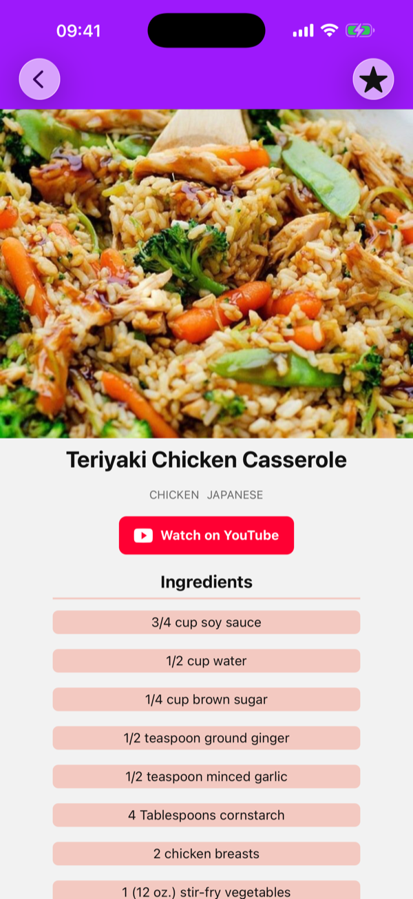
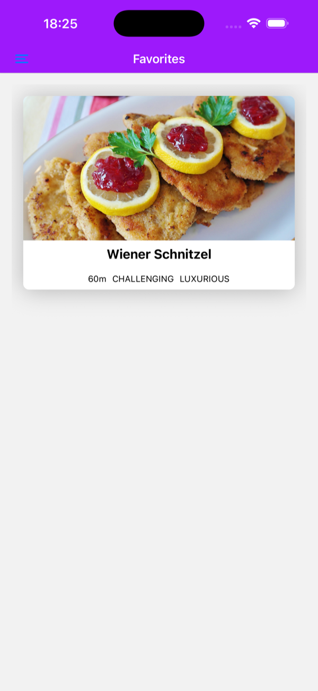
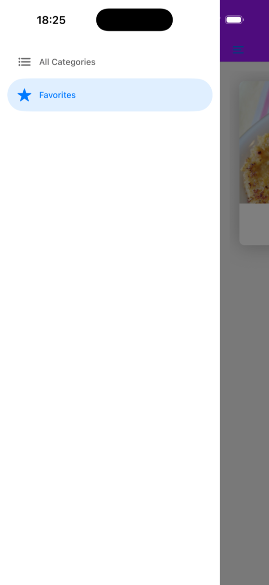
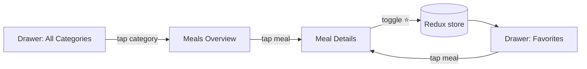

# 🍽️ Meals App

A cross-platform recipe browser for **iOS, Android and Web**, built with **React Native**, **Expo SDK 56** and **TypeScript**. Browse meals by category, see ingredients and step-by-step instructions, and save your favorites. Favorites live in a global store managed with **Redux Toolkit**.

[](https://github.com/GabrielPeixotoo/meals-app/actions/workflows/ci.yml)


---

## 📸 Screenshots

|                                   Categories                                    |                                        Meals by category                                        |                                                    Meal details                                                    |
| :-----------------------------------------------------------------------------: | :---------------------------------------------------------------------------------------------: | :----------------------------------------------------------------------------------------------------------------: |
|  |  |  |

|                                              Favorites                                              |                                              Drawer navigation                                              |
| :-------------------------------------------------------------------------------------------------: | :---------------------------------------------------------------------------------------------------------: |
|  |  |

---

## ✨ Features

- **Category grid:** a two-column grid of color-coded meal categories
- **Meals by category:** filtered list with duration, complexity and affordability
- **Meal details:** hero image, key info, ingredients and preparation steps
- **Favorites:** toggle a meal as favorite from the header; the state is shared app-wide
- **Drawer navigation:** switch between _All Categories_ and _Favorites_
- **Empty state:** friendly message when there are no favorites yet
- **Cross-platform:** one codebase for iOS, Android and Web

---

## 🛠️ Tech Stack

| Area                 | Technology                                                                                                                                   |
| -------------------- | -------------------------------------------------------------------------------------------------------------------------------------------- |
| Framework            | [React Native 0.85](https://reactnative.dev/) · [React 19](https://react.dev/)                                                               |
| Tooling / Runtime    | [Expo SDK 56](https://docs.expo.dev/versions/v56.0.0/)                                                                                       |
| Language             | [TypeScript](https://www.typescriptlang.org/) (`strict` mode)                                                                                |
| Navigation           | [Expo Router](https://docs.expo.dev/router/introduction/): file-based routing with **Stack** + **Drawer** and typed routes                   |
| State management     | [Redux Toolkit](https://redux-toolkit.js.org/) + [React Redux](https://react-redux.js.org/) (a React Context version is kept for comparison) |
| UI                   | React Native core components, `StyleSheet`, [@expo/vector-icons](https://icons.expo.fyi/) (Ionicons)                                         |
| Gestures / Animation | React Native Gesture Handler, Reanimated 4                                                                                                   |
| Performance          | [React Compiler](https://react.dev/learn/react-compiler) enabled via Expo experiments                                                        |
| Web                  | React Native Web with static output                                                                                                          |

---

## 🏗️ Architecture

```
src/
├── app/                      # Expo Router: each file is a route
│   ├── _layout.tsx           # Root Stack + Redux <Provider>
│   ├── (drawer)/             # Route group rendered inside a Drawer
│   │   ├── _layout.tsx       # Drawer configuration (icons, labels, header)
│   │   ├── index.tsx         # All Categories (grid)
│   │   └── favorites.tsx     # Favorite meals + empty state
│   ├── meals_overview.tsx    # Meals filtered by category (dynamic title)
│   └── meal_details.tsx      # Meal details + favorite toggle
├── components/               # Reusable, presentational components
│   ├── CategoryGridTile.tsx
│   ├── IconButton.tsx
│   ├── MealItem.tsx
│   ├── MealDetails/          # Subtitle, List, MealDetailsInfo
│   └── MealsList/            # Shared list used by overview & favorites
├── data/                     # Static seed data (categories & meals)
├── models/                   # TypeScript domain types (Meal, Category)
└── store/
    ├── redux/                # configureStore + favorites slice
    └── context/              # Context API version (kept as reference)
```

### Navigation flow



---

## ✅ Engineering Practices

- **Type safety:** strict TypeScript, typed domain models, typed route params (`useLocalSearchParams<{ id: string }>`) and a typed `RootState`.
- **File-based routing:** routes mirror the folder structure; route groups (`(drawer)`) nest a Drawer inside a Stack without extra config.
- **Separation of concerns:** screens (`app/`), UI components (`components/`), data (`data/`), types (`models/`) and state (`store/`) each live in their own folder.
- **Reusable components:** `MealsList` is shared by the category and favorites screens, so the list logic is written once.
- **State management:** favorites started with the **Context API** and were migrated to **Redux Toolkit** (`createSlice`, `configureStore`, `useSelector`, `useDispatch`). Both versions are in the repo so the trade-offs can be compared.
- **Performance:** virtualized lists with `FlatList`, memoized render callbacks (`useCallback`) and the React Compiler.
- **Path aliases:** clean imports with `@/…` instead of long relative paths.
- **Small commits:** the Git history is incremental and descriptive, one feature per commit.

---

## 🚀 Getting Started

### Prerequisites

- [Node.js](https://nodejs.org/) LTS
- npm
- One of the following: [Expo Go](https://expo.dev/go), an iOS Simulator (Xcode) or an Android Emulator (Android Studio)

### Installation

```bash
git clone https://github.com/GabrielPeixotoo/meals-app.git
cd meals-app
npm install
cp .env.example .env   # optional: the public test key "1" is used by default
```

### Environment variables

| Variable                     | Description                                            | Default               |
| ---------------------------- | ------------------------------------------------------ | --------------------- |
| `EXPO_PUBLIC_MEALDB_API_KEY` | [TheMealDB](https://www.themealdb.com/api.php) API key | `1` (public test key) |

> `EXPO_PUBLIC_` variables are inlined into the app bundle at build time, so they must never hold secrets.

### Running

```bash
npm start          # Start the Expo dev server (scan the QR code with Expo Go)
npm run ios        # Open on the iOS Simulator
npm run android    # Open on the Android Emulator
npm run web        # Open in the browser
npm run lint       # Lint the project
npm run typecheck  # Type-check with TypeScript
npm test           # Run the unit and component tests
```

---

## 🗺️ Roadmap

- [ ] Persist favorites across app restarts (AsyncStorage / redux-persist)
- [ ] Dietary filters (vegan, vegetarian, gluten-free, lactose-free), already present in the data model
- [ ] Typed Redux hooks (`useAppSelector` / `useAppDispatch`) and typed action payloads
- [ ] Unit tests with Jest + React Native Testing Library
- [ ] Fetch meals from a remote API instead of static data
- [ ] Dark mode theme

---

## 👤 Author

**Gabriel Peixoto** · Mobile Developer (React Native and Flutter)

- GitHub: [@GabrielPeixotoo](https://github.com/GabrielPeixotoo)
- LinkedIn: <!-- add your LinkedIn URL -->

---

## 📄 License

See [LICENSE](LICENSE).
