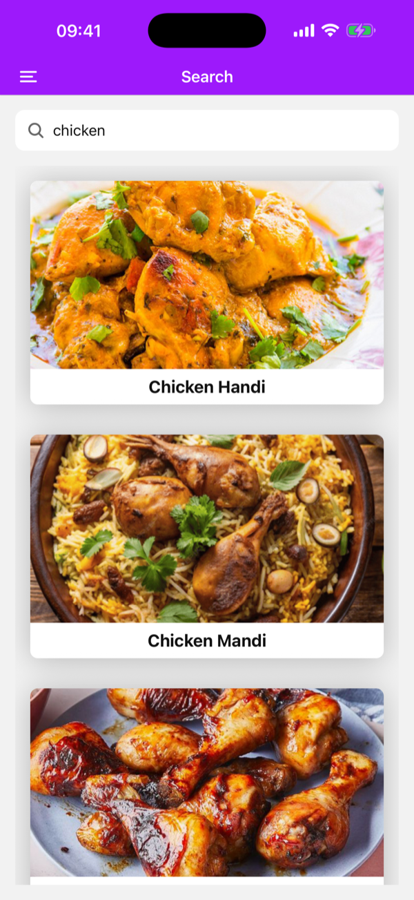
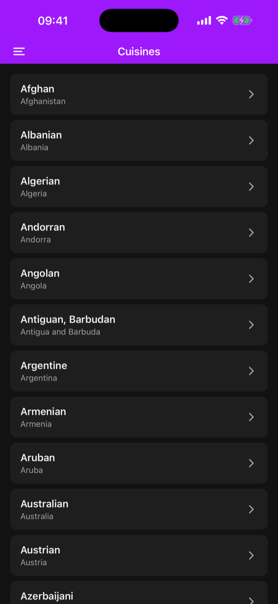
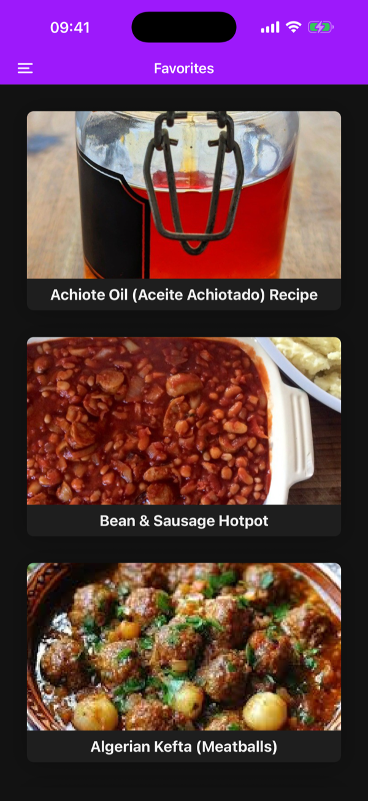
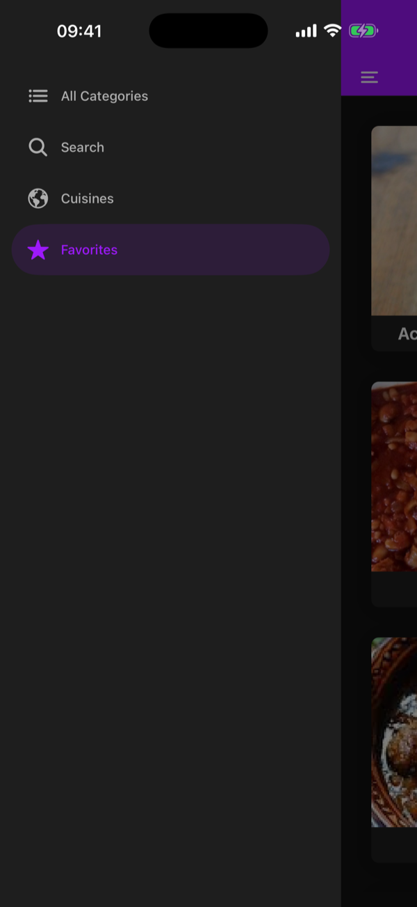
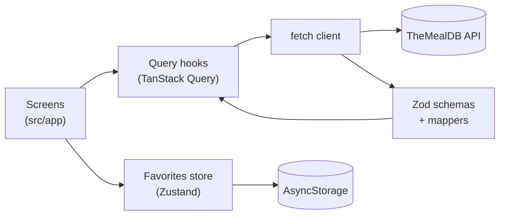

# 🍽️ Meals App

A recipe browser built with **React Native**, **Expo SDK 56** and **TypeScript**. It pulls real data from [TheMealDB](https://www.themealdb.com/) API, lets you search meals by name, browse by category or cuisine, and save favorites that persist on the device. It supports light and dark mode.

[](https://github.com/GabrielPeixotoo/meals-app/actions/workflows/ci.yml)


---

## 📸 Screenshots

|                                        Categories                                         |                                                                   Meal details                                                                    |                                          Search                                          |
| :---------------------------------------------------------------------------------------: | :-----------------------------------------------------------------------------------------------------------------------------------------------: | :--------------------------------------------------------------------------------------: |
|  |  |  |

|                                                Cuisines (dark)                                                |                                            Favorites (dark)                                             |                                      Navigation (dark)                                      |
| :-----------------------------------------------------------------------------------------------------------: | :-----------------------------------------------------------------------------------------------------: | :-----------------------------------------------------------------------------------------: |
|  |  |  |

---

## ✨ Highlights

For a quick review, these are the parts worth looking at:

- **Typed, validated API layer:** every response goes through a [Zod](https://zod.dev) schema that validates it _and_ maps it to the app's own types ([`src/api/schemas.ts`](src/api/schemas.ts)). Screens never see raw API fields.
- **Server state vs. client state:** API data lives in **TanStack Query** (cache, retries, refetch on app focus, pull-to-refresh). Favorites live in a **Zustand** store persisted with AsyncStorage.
- **Every screen handles loading, error and empty states**, with a retry button on errors.
- **34 tests** (unit and component) run on every push in **GitHub Actions**, along with lint, formatting and type checks.
- **Data quirks handled in code:** numeric or string ids, `null` fields, legacy response formats, and cuisines that only match by country name. See [Technical decisions](#-technical-decisions).

---

## 🚀 Features

- **Browse by category:** a grid of categories loaded from the API.
- **Browse by cuisine:** 60+ cuisines, each listed with its country.
- **Search by name:** debounced, keeps the previous results on screen while the next search loads.
- **Surprise me:** the 🔀 button opens a random meal.
- **Meal details:** photo, category, cuisine, ingredients with measures, step-by-step instructions and a **Watch on YouTube** link when available.
- **Favorites:** saved on the device, so they survive app restarts and load offline.
- **Dark mode:** follows the system setting.
- **Deep links:** any screen can be opened by URL and still gets a back button.

---

## 🛠️ Tech Stack

| Area                    | Technology                                                                                                                                                   |
| ----------------------- | ------------------------------------------------------------------------------------------------------------------------------------------------------------ |
| Framework               | [React Native 0.85](https://reactnative.dev/) · [React 19](https://react.dev/) · [Expo SDK 56](https://docs.expo.dev/versions/v56.0.0/)                      |
| Language                | [TypeScript 6](https://www.typescriptlang.org/) in `strict` mode                                                                                             |
| Navigation              | [Expo Router](https://docs.expo.dev/router/introduction/): file-based routing, Stack + Drawer, typed routes                                                  |
| Server state            | [TanStack Query v5](https://tanstack.com/query)                                                                                                              |
| Client state            | [Zustand v5](https://zustand.docs.pmnd.rs/) + [AsyncStorage](https://docs.expo.dev/versions/v56.0.0/sdk/async-storage/)                                      |
| Networking & validation | Native `fetch` + [Zod v4](https://zod.dev)                                                                                                                   |
| UI                      | React Native core components, [expo-image](https://docs.expo.dev/versions/v56.0.0/sdk/image/) (cached images), [@expo/vector-icons](https://icons.expo.fyi/) |
| Testing                 | [Jest](https://jestjs.io/) with `jest-expo` + [React Native Testing Library](https://callstack.github.io/react-native-testing-library/)                      |
| Code quality            | ESLint (`eslint-config-expo`), Prettier, React Compiler                                                                                                      |
| CI                      | [GitHub Actions](.github/workflows/ci.yml)                                                                                                                   |

---

## 🏗️ Architecture

### Data flow



### Project structure

```
src/
├── app/                    # Screens. Expo Router turns each file into a route
│   ├── _layout.tsx         # Root Stack, query client and theme providers
│   ├── (drawer)/           # Screens inside the drawer menu
│   │   ├── index.tsx       # All Categories (+ "Surprise me")
│   │   ├── search.tsx      # Debounced search by name
│   │   ├── cuisines.tsx    # Cuisines by country
│   │   └── favorites.tsx   # Saved meals
│   ├── meals_overview.tsx  # Meals of a category or cuisine
│   └── meal_details.tsx    # Meal details and favorite toggle
├── api/
│   ├── client.ts           # fetch wrapper with typed errors (ApiError)
│   ├── schemas.ts          # Zod schemas: validate and map API responses
│   ├── mappers.ts          # Pure functions for ingredients, steps and tags
│   ├── meals.ts            # One function per API endpoint
│   ├── queries.ts          # TanStack Query hooks and query keys
│   └── queryClient.ts      # Cache and retry configuration
├── store/favorites.ts      # Zustand store persisted with AsyncStorage
├── components/             # Reusable UI (cards, lists, loading/error/empty states)
├── hooks/                  # Theme, debounce, navigation and refresh helpers
└── constants/              # Theme palettes and the cuisines allowlist
```

---

## 🧠 Technical Decisions

**TanStack Query for server state, Zustand for client state.**
API data and app data have different needs. API data needs caching, retries and refetching, which TanStack Query handles out of the box. Favorites are owned by the app, so a small Zustand store with the `persist` middleware is enough. A single global store (like the original Redux version of this app) would have to reimplement caching by hand.

**Native `fetch` + Zod instead of Axios.**
`fetch` is built into React Native, and a [small wrapper](src/api/client.ts) of under 50 lines covers what this app needs: query params, HTTP errors and network errors as a typed `ApiError`. Zod adds what Axios doesn't: it checks responses at runtime. The TypeScript types are inferred from the schemas, so types and validation can't drift apart.

**The API's documented quirks are handled at the edge.**
Following TheMealDB's OpenAPI spec, the schemas accept ids as numbers or strings, treat most fields as nullable or missing, and turn legacy "no data" strings into empty lists. Bad data turns into a clear error instead of an `undefined` crash deep in the UI.

**Cuisines filter by country, not by cuisine name.**
While testing, 163 of 192 cuisines returned no meals when filtered by name ("Brazilian"). The same request by country ("Brazil") returned meals, so the app filters by country. Even then, 132 countries have no meals yet, and checking them at runtime would mean ~195 requests and the API's rate limit. The app keeps a [dated allowlist](src/constants/cuisines.ts) of the 63 countries that have meals and filters with TanStack Query's `select`.

**Favorites store a snapshot of each meal, not just the id.**
The API can only look up one meal per request. Storing `{ id, name, thumbnail }` lets the Favorites screen render instantly and offline, without one request per favorite.

---

## ✅ Testing & CI

```bash
npm test             # run all tests once
npm run test:watch   # re-run on save
```

| Suite                                                        | What it covers                                                                                        |
| ------------------------------------------------------------ | ----------------------------------------------------------------------------------------------------- |
| [`mappers.test.ts`](src/api/__tests__/mappers.test.ts)       | Parsing ingredients (empty slots, 20-item limit), steps ("STEP 1" labels, numbering) and tags         |
| [`schemas.test.ts`](src/api/__tests__/schemas.test.ts)       | The API spec edge cases: numeric ids, null fields, legacy responses, country fallback                 |
| [`client.test.ts`](src/api/__tests__/client.test.ts)         | URL building and `ApiError` for HTTP, network and validation failures                                 |
| [`favorites.test.ts`](src/store/__tests__/favorites.test.ts) | Adding, removing and persisting favorites                                                             |
| [`search.test.tsx`](src/__tests__/search.test.tsx)           | The Search screen end to end with a mocked `fetch`: hint, results, navigation, empty and error states |

Every push and pull request runs lint, formatting, type checking and the tests on [GitHub Actions](.github/workflows/ci.yml).

---

## 💻 Getting Started

### Prerequisites

- [Node.js](https://nodejs.org/) 22 (see [`.nvmrc`](.nvmrc))
- [Expo Go](https://expo.dev/go) on a phone, or the iOS Simulator (Xcode) / an Android Emulator (Android Studio)

### Installation

```bash
git clone https://github.com/GabrielPeixotoo/meals-app.git
cd meals-app
npm install
cp .env.example .env   # optional: the public test key "1" is used by default
```

### Environment variables

| Variable                     | Description                                            | Default               |
| ---------------------------- | ------------------------------------------------------ | --------------------- |
| `EXPO_PUBLIC_MEALDB_API_KEY` | [TheMealDB](https://www.themealdb.com/api.php) API key | `1` (public test key) |

> `EXPO_PUBLIC_` variables are inlined into the app bundle at build time, so they must never hold secrets.

### Scripts

```bash
npm start          # Start the Expo dev server (scan the QR code with Expo Go)
npm run ios        # Open on the iOS Simulator
npm run android    # Open on the Android Emulator
npm run lint       # Lint
npm run format     # Format with Prettier
npm run typecheck  # Type-check with TypeScript
npm test           # Run the tests
```

---

## 🗺️ Roadmap

- [ ] Persist the query cache so browsed meals also work offline
- [ ] End-to-end tests with [Maestro](https://maestro.mobile.dev/)
- [ ] Publish a web demo and an installable build with [EAS](https://docs.expo.dev/eas/)
- [ ] Accessibility pass with VoiceOver and TalkBack

---

## 📜 Project History

This app started as a course exercise with static data and Context/Redux for favorites. It was then rebuilt step by step: the real API with validation, TanStack Query, Zustand persistence, new features, dark mode, tests and CI. The [commit history](https://github.com/GabrielPeixotoo/meals-app/commits/master) shows each step.

---

## 🙏 Acknowledgements

Meal data and images come from [TheMealDB](https://www.themealdb.com/), a free, crowd-sourced recipe database.

---

## 👤 Author

**Gabriel Peixoto** · Mobile Developer (React Native and Flutter)

- LinkedIn: [gabriel-peixoto-b4b134200](https://www.linkedin.com/in/gabriel-peixoto-b4b134200/)
- GitHub: [@GabrielPeixotoo](https://github.com/GabrielPeixotoo)

---

## 📄 License

[MIT](LICENSE) © Gabriel Peixoto
